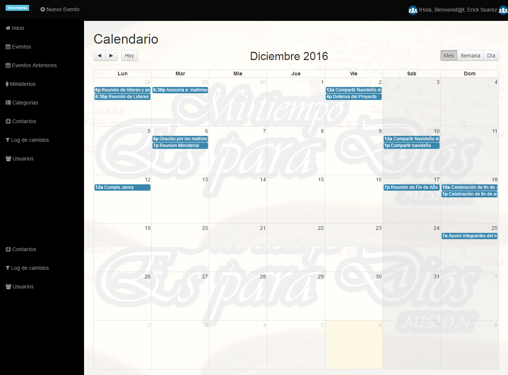
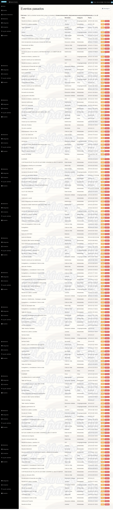
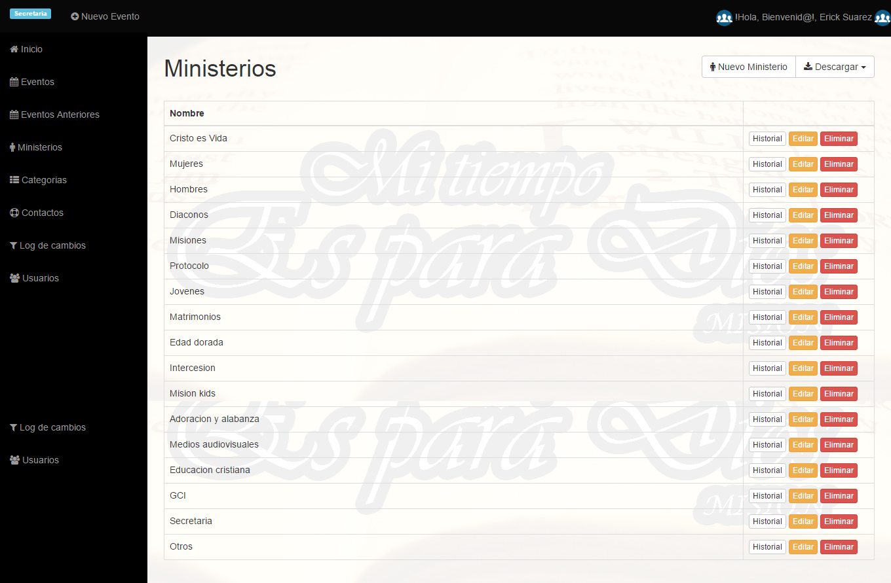
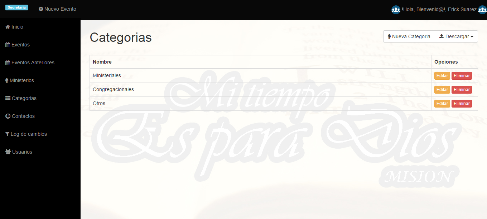
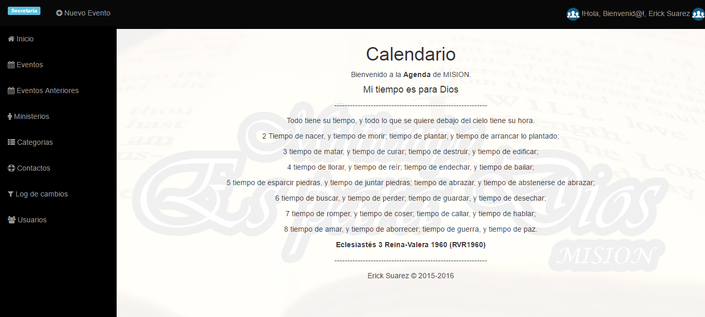
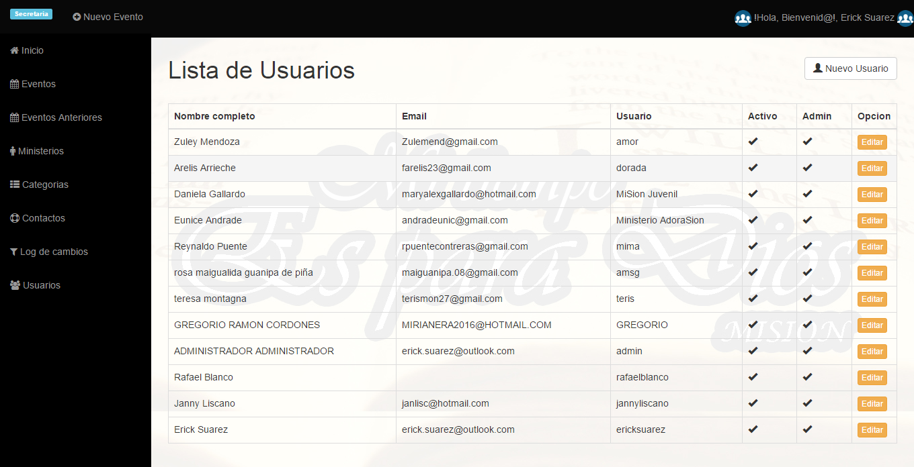
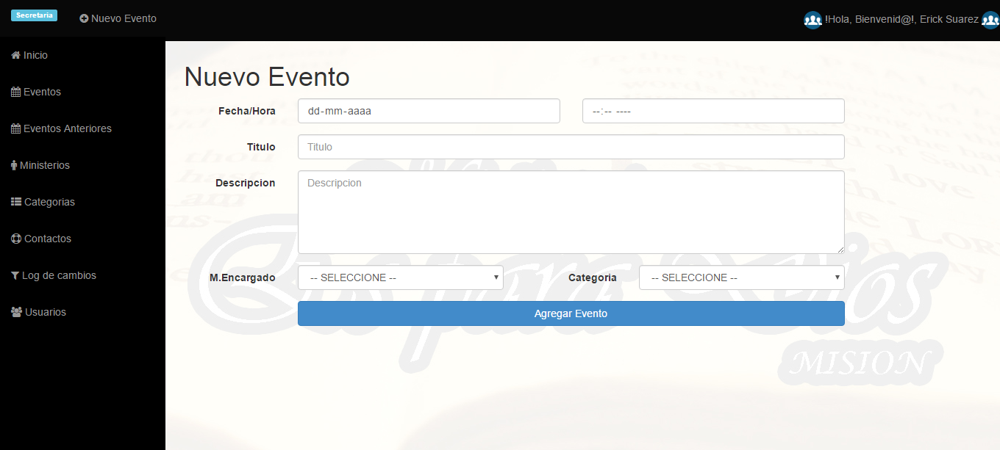

# (CALENDARIO) Calendario generico para eventos.

Lo que necesitas modificar:


- core/controller/Database.php

```core/controller/Database.php

<?php
class Database {
	public static $db;
	public static $con;
	function Database(){
	$this->user="usuario_base_de_datos";$this->pass="clave_de_base_de_datos";$this->host="localhost";$this->ddbb="nombre_base_de_datos";
	}

	function connect(){
		$con = new mysqli($this->host,$this->user,$this->pass,$this->ddbb);
		return $con;
	}

	public static function getCon(){
		if(self::$con==null && self::$db==null){
			self::$db = new Database();
			self::$con = self::$db->connect();
		}
		return self::$con;
	}
	
}
?>

```









